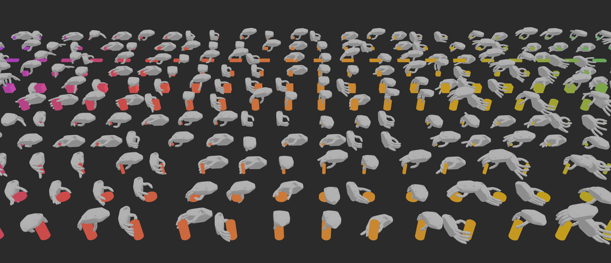

# DexGraspNet: A Large-Scale Robotic Dexterous Grasp Dataset for General Objects Based on Simulation

This is the official repository of [DexGraspNet: A Large-Scale Robotic Dexterous Grasp Dataset for General Objects Based on Simulation](https://arxiv.org/abs/2210.02697).

[[project page]](https://pku-epic.github.io/DexGraspNet/)

## Introduction



## Overview

This repository provides:

- Simple tools for visualizing grasp data.
- Asset processing for object models. See folder `asset_process`.
- Grasp generation. See folder `grasp_generation`.
  - We also updated code for
    - MANO grasp generation
    - Dexhand021 grasp generation
    - ShadowHand grasp generation for objects on the table
  - See other branches for more information [TODO: update documents].

Our working file structure is as:

```bash
DexGraspNet
+-- asset_process
+-- grasp_generation
+-- data
|  +-- meshdata  # Linked to the output folder of asset processing.
|  +-- experiments  # Linked to a folder in the data disk. Small-scale experimental results go here.
|  +-- graspdata  # Linked to a folder in the data disk. Large-scale generated grasps go here, waiting for grasp validation.
|  +-- dataset  # Linked to a folder in the data disk. Validated results go here.
+-- thirdparty
|  +-- pytorch_kinematics
|  +-- CoACD
|  +-- ManifoldPlus
|  +-- TorchSDF
```

## Installation

### Prerequisites
- Linux system with NVIDIA GPU
- CUDA 12.1 compatible GPU
- Python 3.8
- Conda package manager

### Environment Setup

```bash
# Create conda environment
conda create -n dexgraspnet python=3.8 -y
conda activate dexgraspnet

# Install basic dependencies
pip install numpy tqdm transforms3d trimesh plotly tensorboard

# Install PyTorch with CUDA support
pip install torch==2.1.0 torchvision==0.16.0 torchaudio==2.1.0 --index-url https://download.pytorch.org/whl/cu121

# Install CUDA toolkit (required for compiling extensions)
conda install -c nvidia cuda-toolkit=12.1 -y
conda install -c conda-forge libxcrypt -y

# Install pytorch3d (MUST be built from source for GPU support)
pip uninstall pytorch3d -y  # Remove any existing installation
pip install --no-build-isolation "git+https://github.com/facebookresearch/pytorch3d.git@stable"

# Install additional required packages
pip install urdf_parser_py scipy networkx
conda install rtree -y

# Install pytorch_kinematics (modified, included in repo)
cd thirdparty/pytorch_kinematics
pip install -e .
cd ../..

# Install TorchSDF (requires compatibility fixes for PyTorch 2.x)
cd thirdparty/TorchSDF
git checkout 0.1.0
export IGNORE_TORCH_VER=1
python setup.py develop
cd ../..
```

**Important Notes**:
- Python 3.8 is recommended (Python 3.7 only needed if using Isaac Gym validation)
- PyTorch 2.1.0 + CUDA 12.1 is the recommended version
- pytorch3d MUST be installed with `--no-build-isolation` and built from source for GPU support
- TorchSDF requires compatibility fixes for PyTorch 2.x (already applied in this repo)

### Build External Tools

```bash
cd asset_process/

# Build ManifoldPlus
git clone https://github.com/hjwdzh/ManifoldPlus.git
cd ManifoldPlus
git submodule update --init --recursive
mkdir build && cd build
cmake .. -DCMAKE_BUILD_TYPE=Release
make -j8
cd ../..

# Build CoACD
git clone --recurse-submodules https://github.com/SarahWeiii/CoACD.git
cd CoACD
mkdir build && cd build
cmake .. -DCMAKE_BUILD_TYPE=Release
make
cd ../..
```

## Quick Start

### Process 3D Models

```bash
cd asset_process/

# Step 1: Convert to manifold meshes
python convert_with_trimesh.py --src ../data/raw_models --dst ../data/manifolds

# Step 2: Normalize models
python normalize.py --src ../data/manifolds --dst ../data/normalized_models

# Step 3: Convex decomposition
python decompose_list.py --src ../data/normalized_models --dst ../data/meshdata --coacd_path ./CoACD/build/main
bash run.sh  # or: python poolrun.py -p 32 for parallel processing
```

### Generate Grasps

```bash
cd grasp_generation/

# Generate grasps for one object
python main.py \
  --object_code_list "['cylinder1']" \
  --name test_shadowhand \
  --n_contact 4 \
  --batch_size 128 \
  --n_iter 6000 \
  --gpu "0"

# Generate grasps for multiple objects
python main.py \
  --object_code_list "['banana', 'cube1', 'sphere1']" \
  --name test_multiple \
  --n_contact 4 \
  --batch_size 128 \
  --n_iter 6000 \
  --gpu "0"
```

### Visualize Results

```bash
cd grasp_generation/tests/

# Visualize specific grasp (generates HTML file)
python visualize_result.py \
  --object_code banana \
  --num 0 \
  --result_path ../data/experiments/test_shadowhand/results

# Open grasp_visualization_banana_0.html in a web browser
```

**Note**: `--num` is the grasp index (0 = best grasp, 1 = second best, etc.).

## Documentation

For detailed installation instructions, troubleshooting, and architecture details, see [CLAUDE.md](./CLAUDE.md).

